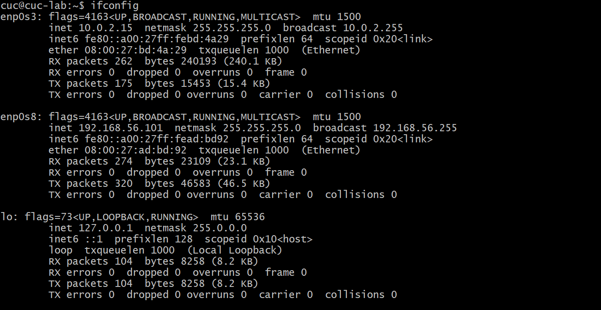
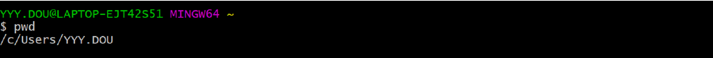
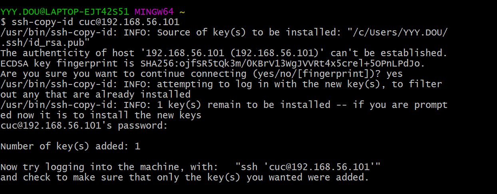

# Linux作业1

### 1、调查并记录实验环境的如下信息：

首先打开已经安装好的虚拟机ub20.04.2 ,并且输入用户名和密码

- 当前 Linux 发行版基本信息

  使用lsb_release -a 命令可以进行查询

  ！！可以使用Tab快捷键来自动补全

  如果查询版本号：lsb_release -r

  如果查询版本描述信息：lsb_release -d

  如果查询lsb_release支持的所有参数：lsb_release -h

  

- 当前 Linux 内核版本信息

  使用uname -a 命令可以进行查询
  
  
  
  ！！阿里云也和这个一致
  
  

### 2、Virtualbox 安装完 Ubuntu 之后新添加的网卡如何实现系统开机自动启用和自动获取 IP？

参考网址：https://blog.csdn.net/xiongyangg/article/details/110206220l

（1）首先对全部网卡进行查询：ifconfig -a

（2）查看当前网卡:ifconfig

（3）比较二者：

如果当前和全部网卡是一样的，则已经实现了系统开机自动启用和自动获取 IP：20

若二者不一样，则需要添加网卡，具体操作如下：

进入VIM：

然后修改并添加网卡设置:如添加enp0s9

退出VIM：先按Esc键，然后输入：x（！！！！：也是输入内容）

最后，再输入sudo netplan apply命令就修改好了

操作如上所示，但ub20版本已经自动连好，所以就不需要修改了，我尝试增加enp0s9网卡但操作未果，因为其本身没有这个网卡，所以在增加后进行网卡查找命令ifconfig时依旧显示只有两个网卡，如果遇到ub18则同上操作即可

### 3、如何使用 `scp` 在「虚拟机和宿主机之间」、「本机和远程 Linux 系统之间」传输文件？

#### 「虚拟机和宿主机之间」：

参考网址：https://www.cnblogs.com/liuhui-xzz/p/11441457.html

（1）先找到WINSCP官网，点击下载其安装包

网址：https://winscp.net/eng/download.php

（2）开始安装WINSCP：

点击建议选项

选择典型安装

选择用户界面风格

最后点击安装，安装成功之后如下所示：

（3）然后连接虚拟机：

首先要获取虚拟机IP地址：用ip a 可以查询

！！这里会遇到一个问题：

如果你的网卡没有修改的话，查询结果如下 ：是以127开头的地址

127开头的IP主要用于测试 如:127.0.0.1 本机地址,主要用于测试。用汉语表示,就是“我自己”。Windows

系统中,这个地址有一个别名“Localhost”。寻址这样一个地址,是不能把它发到网络接口的。除非出错,否

则在传输介质上永远不应该出现目的地址为“127.0.0.1”的数据包。    

所以，一定要改网卡，具体改动如下：

然后就得到了IP地址，再输入用户名和密码就 可以连接虚拟机了

（4）然后从左边选择需要上传的文件，点击上传就可以传输了

#### 这是我3月7日之前做的，结果那天老师说的时候我才知道Windows有自带的SCP，在CMD上操作就可以了，麻了，所以再次操作如下：

### CMD操作：

#### 虚拟机----->宿主机：

（1）在git bash上进行虚拟机免密登录

（2）虚拟机创建文件：和「本机和远程 Linux 系统之间」操作一致

（3）查询本机IP

（4）传输：

#### 宿主机----->虚拟机：

（1）在桌面或者其他位置创建文件

（2）进行传输：

！！！！！传文件时一定要注意路径！！！！！！！！！

不能用相对路径，要用绝对路径：

#### 「本机和远程 Linux 系统之间」：

#### 远程Linux系统-------->本机：

（1）首先在Linux中创建一个文件并且对其进行命名：

（2）对文件内容进行编写或再创建

（3）显示当前目录绝对路径

（4）对文件进行传输

传输成功，并且可以在本地找到文件：

内容和编写的一样：

本机---------->远程Linux系统：和上面宿主机到虚拟机的操作一致，但我的阿里云体验时间到了，所以显示失去连接

### 4、如何配置 SSH 免密登录？

参考网址：https://jingyan.baidu.com/article/c74d6000b499160f6a595de6.html

本地：

（1）打开git bash，没有的去官网下载

（2）创建密钥：输入ssh-keygen

​                              其他遇到：直接回车即可

（3）将公钥加入远程主机：输入ssh-copy-id 用户名@IP地址

​                                                 确定继续连接

​                                                 输入密码

（4）用户免密登录：输入ssh 用户名@IP地址

就可以直接用啦！！！！！用ip a做实验可知确实已经登录了！

阿里云：

其余同上

### 小结：

主要遇到的问题：

1、第二题按照参考网址写出来之后发现自己根本没有改成功，后来又认真读了一下并且问了一下同学，发现ifconfig和ifconfig -a这两个命令对比可以看出已经有的网卡是不是实现了系统开机自动启用和自动获取 IP，而如果二者相等的话是表示所有网卡都已经实现了系统开机自动启用和自动获取 IP，但在ub18中利用这种操作是可以实现的。

2、第三题的路径问题：刚开始因为没有很好地理解一些命令，导致路径写得不对，所以出现了密码输入不正确和找不到文件的问题，出现这种蠢问题的应该maybe只有我一个吧

3、还有很多是CMD和git bash之间命令的不同而导致的，有些命令是可以在git bash上进行的，但不可以在CMD上进行

总得来说，对于Linux系统还是比较陌生，而且思维不是很能及时跟上老师跳跃的思维，表达理解能力也比较差，很多时候抓不住重点，不幸中的万幸是我们有录播（录播救我狗命），希望以后可以更顺利一些

#### 参考网址：

https://blog.csdn.net/xiongyangg/article/details/110206220l

https://www.cnblogs.com/liuhui-xzz/p/11441457.html

https://winscp.net/eng/download.php

https://jingyan.baidu.com/article/c74d6000b499160f6a595de6.html

