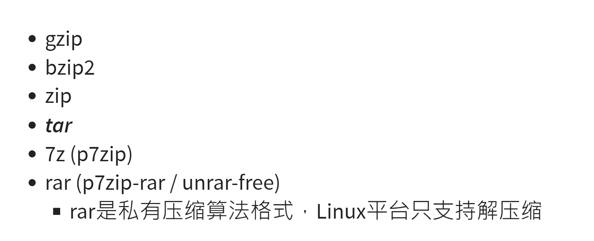

# Linux作业2

## 利用asciinema进行录屏操作下面内容：

（1）安装注册asciinema

### 本地：

利用这三个命令安装：asciinema

sudo apt-add-repository ppa:zanchey/asciinema
sudo apt-get update
sudo apt-get install asciinema

获得登录后的asciinema链接

复制该链接后覆盖原登录后的网址，之后就可以使用了

### 阿里云：

sudo yum install python-pip

sudo pip3 install asciinema

再次登录asciinema就可以录屏了

（2）进行录屏操作：输入asciinema rec就可以进入录屏

## 作业操作：

## 1、软件包管理：在目标发行版上安装 tmux 和 tshark ；查看这 2 个软件被安装到哪些路径；卸载 tshark ；验证 tshark 卸载结果

### 本地：

#### 第一个录屏：tmux和tshark的下载安装

tmux:sudo apt update && sudo apt install tmux

tshark:sudo apt-get install tshark

https://asciinema.org/a/Fhl97XnAens9oDQyvkZQsmpKh)

#### 第二个录屏：查看两个软件的安装路径

dpkg -L tmux

dpkg -L tshark

#### 第三个录屏：卸载tshark

apt-get --purge remove tshark

apt-get autoremove tshark

#### 第四个录屏：查看tshark卸载情况

dpkg -L tshark

### 阿里云：

#### 第一个录屏：tmux和tshark的下载安装

yum install tmux

yum install wireshark(在CentOS中，没有单独的tshark安装包，它包含在wireshark中，因此只需安装wireshark。)

PS:这里我安装的时候忘记录屏了，所以显示的是已经安装了

#### 第二个录屏：查看两个软件的安装路径

rpm -qal | grep tmux

rpm -qal | grep wireshark

#### 第三个录屏：卸载tshark

yum -y remove wireshark

## 2、文件管理：

- ## 复制以下

## cd /tmp && for i in $(seq 0 1024);do dir="test-$RANDOM";mkdir "$dir";echo "$RANDOM" > "$dir/$dir-$RANDOM";done

## 代码到终端运行，在目标 Linux 发行版系统中构造测试数据集，然后回答以下问题：

- ## 找到 /tmp 目录及其所有子目录下，文件名包含 666 的所有文件

- ## 找到 /tmp 目录及其所有子目录下，文件内容包含 666 的所有文件

### 本地：

找到 /tmp 目录及其所有子目录下，文件名包含 666 的所有文件: find | grep 666

找到 /tmp 目录及其所有子目录下，文件内容包含 666 的所有文件:grep -r 666

### 阿里云：

找到 /tmp 目录及其所有子目录下，文件名包含 666 的所有文件: sudo find ./ -type f -name "*666*"

找到 /tmp 目录及其所有子目录下，文件内容包含 666 的所有文件:sudo grep -r "666" ./ --exclude=*.cast

## 3、文件压缩与解压缩：练习课件中 [文件压缩与解压缩](https://c4pr1c3.github.io/LinuxSysAdmin/chap0x02.md.html#/12/1) 一节所有提到的压缩与解压缩命令的使用方法

### 本地和阿里云一致：

先创建压缩和解压缩的文件并传到虚拟机

压缩：

tar:	tar -cvf examples.tar examples

tgz:	tar -zcvf examples.tgz examples

gzip:	gzip -r examples.gz examples

zip:	zip -r examples.zip examples (examples为目录)

rar：rar是私有压缩算法格式，Linux只支持解压缩

7z(p7zip)：7za a examples.7z exampes

bzip2：bzip2 -v8 example（不能压缩文件夹，只能压缩里面的文件，而且文件内容不能为空）

解压缩：

tar:	tar -xvf examples.tar 

tgz:	tar -zxvf examples.tgz 

gzip:	gunzip -r examples.gz 

zip:	unzip examples.zip 

rar:	unrar examples.rar

7z(p7zip)：7za e examples.7z 

bzip2：bzip2 -d example.bz2

## 4、跟练：[子进程管理实验](https://asciinema.org/a/f3ux5ogwbxwo2q0wxxd0hmn54)

## 5、硬件信息获取:目标系统的 CPU、内存大小、硬盘数量与硬盘容量

### 本地：

目标系统的 CPU：

grep "model name" /proc/cpuinfo |awk -F ':' '{print $NF}'  (查看CPU型号)
cat /proc/cpuinfo | grep "physical id" | uniq | wc -l   (查看CPU个数)
cat /proc/cpuinfo | grep "cpu cores" | uniq    (查看CPU核数)

内存大小：

cat /proc/meminfo | grep MemTotal

硬盘数量与硬盘容量：

sudo fdisk -l | grep Disk

### 阿里云：

目标系统的 CPU：

cat /proc/cpuinfo | grep 'model name' |uniq   (查看CPU型号)
cat /proc/cpuinfo | grep "physical id" | uniq | wc -l   (查看CPU个数)
cat /proc/cpuinfo | grep "cpu cores" | uniq   (查看CPU核数)

内存大小：

cat /proc/meminfo | grep MemTotal

硬盘数量与硬盘容量：

df -hl   (查看磁盘剩余空间)
df -h    (展示文件系统信息)

## 对比表格：

| Linux发行版本     |                      本地 Ubuntu 20.04                       |                    阿里云 CentOS 7.7                    |
| ----------------- | :----------------------------------------------------------: | :-----------------------------------------------------: |
| 安装软件包        |                       sudo apt install                       |                       yum install                       |
| 更新软件包        |                       sudo apt update                        |                       yum update                        |
| 查看安装路径      |                           dpkg -L                            |                        rpm -qal                         |
| 卸载软件包        | apt-get --purge remove（卸载安装包）/apt-get autoremove(卸载附件) |                      yum -y remove                      |
| 查找文件名        |                         find \| grep                         |            sudo find ./ -type f -name "666"             |
| 查找文件内容      |                           grep -r                            |         sudo grep -r "666" ./ --exclude=*.cast          |
| gzip文件压缩      |                 gzip -r examples.gz examples                 |                          同左                           |
| gzip文件解压      |                    gunzip -r examples.gz                     |                          同左                           |
| bzip2文件压缩     | bzip2 -v8 example（不能压缩文件夹，只能压缩里面的文件，而且文件内容不能为空） |                          同左                           |
| bzip2文件解压     |                     bzip2 -d example.bz2                     |                          同左                           |
| zip文件压缩       |                     zip -r examples.zip                      |                          同左                           |
| zip文件解压       |                      unzip examples.zip                      |                          同左                           |
| tar文件压缩       |                tar -cvf examples.tar examples                |                          同左                           |
| tar文件解压       |                    tar -xvf examples.tar                     |                          同左                           |
| 7z(p7zip)文件压缩 |                  7za a examples.7z exampes                   |                          同左                           |
| 7z(p7zip)文件解压 |                      7za e examples.7z                       |                          同左                           |
| rar文件压缩       |           rar是私有压缩算法格式，Linux只支持解压缩           |                          同左                           |
| rar文件解压       |                      unrar examples.rar                      |                          同左                           |
| CPU硬件信息获取   | grep "model name" /proc/cpuinfo \| awk -F ':' '{print $NF}'  (查看CPU型号) |                    cat /proc/cpuinfo                    |
| 内存硬件信息获取  |              cat /proc/meminfo \| grep MemTotal              |                    cat /proc/meminfo                    |
| 硬盘硬件信息获取  |                  sudo fdisk -l \| grep Disk                  | df -hl   (查看磁盘剩余空间)/df -h    (展示文件系统信息) |

## 遇到的问题：

1、tshark的安装问题

sudo apt update && sudo apt install tshark   命令失败

sudo apt install tshark     命令失败

sudo apt-get install tshark   命令成功

这三个命令有什么区别吗，而且不同的电脑上面它们运行的成功与否也是不一样的

2、跟练时遇到无限循环的无法退出问题：

我以为错了问题的关键，我以为退出循环的关键是ping www.baidu.com

其实是fg，就因为这个搞得我特别痛苦，果然无限流最可怕了。

3、压缩和解压缩的时候要注意路径问题，有的不能压缩文件夹，只能压缩文件夹里面的文件，例如：

bzip2不能压缩文件夹，只能压缩里面的文件，而且文件内容不能为空.

4、输入命令的时候出错比较多，但其实都是一些细节上的小问题，所以视频都比较长，真的很抱歉

## 参考网址：

https://asciinema.org/docs/installation

https://blog.csdn.net/lunhui1994_/article/details/80546454

https://blog.csdn.net/Three_dog/article/details/102497540

https://blog.csdn.net/weixin_32597009/article/details/116555761

https://blog.csdn.net/dream_broken/article/details/52883883?locationNum=10&fps=1

https://blog.csdn.net/weixin_42109925/article/details/116553434

