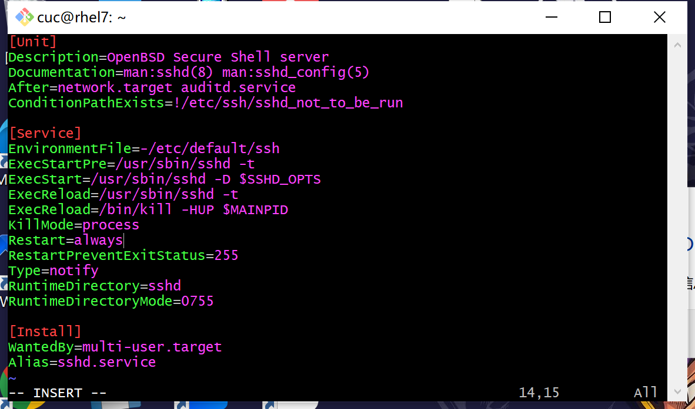

Linux作业

systemd入门教程：

一、由来

下面的命令用来启动服务。

> ```bash
> $ sudo /etc/init.d/apache2 start
> # 或者
> $ service apache2 start
> ```

[](https://asciinema.org/a/481704)


二、systemd概述

查看 Systemd 的版本：

> ```bash
> $ systemctl --version
> ```

[](https://asciinema.org/a/481723)


三、系统管理

3.1 systemctl

```bash
# 重启系统
$ sudo systemctl reboot
```


```bash
# 关闭系统，切断电源
$ sudo systemctl poweroff
```


虚拟机直接被关闭

```bash
# CPU停止工作
$ sudo systemctl halt
```


```bash
# 暂停系统
$ sudo systemctl suspend
```


虚拟机黑屏

```bash
# 让系统进入冬眠状态
$ sudo systemctl hibernate
```


虚拟机关机

```bash
# 让系统进入交互式休眠状态
$ sudo systemctl hybrid-sleep
```


虚拟机关闭

```bash
# 启动进入救援状态（单用户状态）
$ sudo systemctl rescue
```


3.2 systemd-analyze

`systemd-analyze`命令用于查看启动耗时。

```bash
# 查看启动耗时
$ systemd-analyze  
```

```bash
# 查看每个服务的启动耗时
$ systemd-analyze blame
```

```bash
# 显示瀑布状的启动过程流
$ systemd-analyze critical-chain
```

```bash
# 显示指定服务的启动流
$ systemd-analyze critical-chain atd.service
```

[](https://asciinema.org/a/481770)


3.3 hostnamectl

`hostnamectl`命令用于查看当前主机的信息。

> ```bash
> # 显示当前主机的信息
> $ hostnamectl
> 
> # 设置主机名。
> $ sudo hostnamectl set-hostname rhel7
> ```

[](https://asciinema.org/a/481775)


3.4 localectl

`localectl`命令用于查看本地化设置。

> ```bash
> # 查看本地化设置
> $ localectl
> 
> # 设置本地化参数。
> $ sudo localectl set-locale LANG=en_GB.utf8
> $ sudo localectl set-keymap en_GB
> ```

[](https://asciinema.org/a/481777)


3.5 timedatectl

`timedatectl`命令用于查看当前时区设置。

> ```bash
> # 查看当前时区设置
> $ timedatectl
> 
> # 显示所有可用的时区
> $ timedatectl list-timezones                                                                                   
> 
> # 设置当前时区
> $ sudo timedatectl set-timezone America/New_York
> $ sudo timedatectl set-time YYYY-MM-DD
> $ sudo timedatectl set-time HH:MM:SS
> ```

[](https://asciinema.org/a/481779)


3.6 loginctl

`loginctl`命令用于查看当前登录的用户。

> ```bash
> # 列出当前session
> $ loginctl list-sessions
> 
> # 列出当前登录用户
> $ loginctl list-users
> 
> # 列出显示指定用户的信息
> $ loginctl show-user ruanyf
> ```

[](https://asciinema.org/a/481780)


四、unit

4.1 含义

Systemd 可以管理所有系统资源。不同的资源统称为 Unit（单位）。

`systemctl list-units`命令可以查看当前系统的所有 Unit 。

> ```bash
> # 列出正在运行的 Unit
> $ systemctl list-units
> 
> # 列出所有Unit，包括没有找到配置文件的或者启动失败的
> $ systemctl list-units --all
> 
> # 列出所有没有运行的 Unit
> $ systemctl list-units --all --state=inactive
> 
> # 列出所有加载失败的 Unit
> $ systemctl list-units --failed
> 
> # 列出所有正在运行的、类型为 service 的 Unit
> $ systemctl list-units --type=service
> ```

[](https://asciinema.org/a/482065)


4.2 unit的状态

`systemctl status`命令用于查看系统状态和单个 Unit 的状态。

> ```bash
> # 显示系统状态
> $ systemctl status
> 
> # 显示单个 Unit 的状态
> $ systemctl status bluetooth.service
> 
> # 显示远程主机的某个 Unit 的状态
> $ systemctl -H root@rhel7.example.com status httpd.service
> ```

[](https://asciinema.org/a/483533)

除了`status`命令，`systemctl`还提供了三个查询状态的简单方法，主要供脚本内部的判断语句使用。

> ```bash
> # 显示某个 Unit 是否正在运行
> $ systemctl is-active application.service
> 
> # 显示某个 Unit 是否处于启动失败状态
> $ systemctl is-failed application.service
> 
> # 显示某个 Unit 服务是否建立了启动链接
> $ systemctl is-enabled application.service
> ```

[](https://asciinema.org/a/483525)


4.3 unit 管理

对于用户来说，最常用的是下面这些命令，用于启动和停止 Unit（主要是 service）。

> ```bash
> # 立即启动一个服务
> $ sudo systemctl start apache.service
> 
> # 立即停止一个服务
> $ sudo systemctl stop apache.service
> 
> # 重启一个服务
> $ sudo systemctl restart apache.service
> 
> # 杀死一个服务的所有子进程
> $ sudo systemctl kill apache.service
> 
> # 重新加载一个服务的配置文件
> $ sudo systemctl reload apache.service
> 
> # 重载所有修改过的配置文件
> $ sudo systemctl daemon-reload
> 
> # 显示某个 Unit 的所有底层参数
> $ systemctl show httpd.service
> 
> # 显示某个 Unit 的指定属性的值
> $ systemctl show -p CPUShares httpd.service
> 
> # 设置某个 Unit 的指定属性
> $ sudo systemctl set-property httpd.service CPUShares=500
> ```

[](https://asciinema.org/a/482149)


### 4.4 依赖关系

Unit 之间存在依赖关系：A 依赖于 B，就意味着 Systemd 在启动 A 的时候，同时会去启动 B。

`systemctl list-dependencies`命令列出一个 Unit 的所有依赖。

> ```bash
> $ systemctl list-dependencies nginx.service
> ```

上面命令的输出结果之中，有些依赖是 Target 类型（详见下文），默认不会展开显示。如果要展开 Target，就需要使用`--all`参数。

> ```bash
> $ systemctl list-dependencies --all nginx.service
> ```

[](https://asciinema.org/a/482151)


五、Unit 的配置文件

5.1 概述

每一个 Unit 都有一个配置文件，告诉 Systemd 怎么启动这个 Unit 。

Systemd 默认从目录`/etc/systemd/system/`读取配置文件。但是，里面存放的大部分文件都是符号链接，指向目录`/usr/lib/systemd/system/`，真正的配置文件存放在那个目录。

`systemctl enable`命令用于在上面两个目录之间，建立符号链接关系。

> ```bash
> $ sudo systemctl enable clamd@scan.service
> # 等同于
> $ sudo ln -s '/usr/lib/systemd/system/clamd@scan.service' '/etc/systemd/system/multi-user.target.wants/clamd@scan.service'
> ```

如果配置文件里面设置了开机启动，`systemctl enable`命令相当于激活开机启动。

与之对应的，`systemctl disable`命令用于在两个目录之间，撤销符号链接关系，相当于撤销开机启动。

> ```bash
> $ sudo systemctl disable clamd@scan.service
> ```

配置文件的后缀名，就是该 Unit 的种类，比如`sshd.socket`。如果省略，Systemd 默认后缀名为`.service`，所以`sshd`会被理解成`sshd.service`。

[](https://asciinema.org/a/483553)


5.2 配置文件的状态

`systemctl list-unit-files`命令用于列出所有配置文件。

> ```bash
> # 列出所有配置文件
> $ systemctl list-unit-files
> 
> # 列出指定类型的配置文件
> $ systemctl list-unit-files --type=service
> ```

这个命令会输出一个列表。

> ```bash
> $ systemctl list-unit-files
> 
> UNIT FILE              STATE
> chronyd.service        enabled
> clamd@.service         static
> clamd@scan.service     disabled
> ```

这个列表显示每个配置文件的状态，一共有四种。

> - enabled：已建立启动链接
> - disabled：没建立启动链接
> - static：该配置文件没有`[Install]`部分（无法执行），只能作为其他配置文件的依赖
> - masked：该配置文件被禁止建立启动链接

注意，从配置文件的状态无法看出，该 Unit 是否正在运行。这必须执行前面提到的`systemctl status`命令。

> ```bash
> $ systemctl status bluetooth.service
> ```

一旦修改配置文件，就要让 SystemD 重新加载配置文件，然后重新启动，否则修改不会生效。

> ```bash
> $ sudo systemctl daemon-reload
> $ sudo systemctl restart httpd.service
> ```

[](https://asciinema.org/a/483556)


5.3 配置文件的格式

配置文件就是普通的文本文件，可以用文本编辑器打开。

`systemctl cat`命令可以查看配置文件的内容。

> ```bash
> $ systemctl cat atd.service
> 
> [Unit]
> Description=ATD daemon
> 
> [Service]
> Type=forking
> ExecStart=/usr/bin/atd
> 
> [Install]
> WantedBy=multi-user.target
> ```

从上面的输出可以看到，配置文件分成几个区块。每个区块的第一行，是用方括号表示的区别名，比如`[Unit]`。注意，配置文件的区块名和字段名，都是大小写敏感的。

每个区块内部是一些等号连接的键值对。

> ```bash
> [Section]
> Directive1=value
> Directive2=value
> 
> . . .
> ```

注意，键值对的等号两侧不能有空格。

[](https://asciinema.org/a/483560)


六、Target

启动计算机的时候，需要启动大量的 Unit。如果每一次启动，都要一一写明本次启动需要哪些 Unit，显然非常不方便。Systemd 的解决方案就是 Target。

简单说，Target 就是一个 Unit 组，包含许多相关的 Unit 。启动某个 Target 的时候，Systemd 就会启动里面所有的 Unit。从这个意义上说，Target 这个概念类似于"状态点"，启动某个 Target 就好比启动到某种状态。

传统的`init`启动模式里面，有 RunLevel 的概念，跟 Target 的作用很类似。不同的是，RunLevel 是互斥的，不可能多个 RunLevel 同时启动，但是多个 Target 可以同时启动。

> ```bash
> # 查看当前系统的所有 Target
> $ systemctl list-unit-files --type=target
> 
> # 查看一个 Target 包含的所有 Unit
> $ systemctl list-dependencies multi-user.target
> 
> # 查看启动时的默认 Target
> $ systemctl get-default
> 
> # 设置启动时的默认 Target
> $ sudo systemctl set-default multi-user.target
> 
> # 切换 Target 时，默认不关闭前一个 Target 启动的进程，
> # systemctl isolate 命令改变这种行为，
> # 关闭前一个 Target 里面所有不属于后一个 Target 的进程
> $ sudo systemctl isolate multi-user.target
> ```

[](https://asciinema.org/a/483565)


七、日志管理

Systemd 统一管理所有 Unit 的启动日志。带来的好处就是，可以只用`journalctl`一个命令，查看所有日志（内核日志和应用日志）。日志的配置文件是`/etc/systemd/journald.conf`。

`journalctl`功能强大，用法非常多。

> ```bash
> # 查看所有日志（默认情况下 ，只保存本次启动的日志）
> $ sudo journalctl
> 
> # 查看内核日志（不显示应用日志）
> $ sudo journalctl -k
> 
> # 查看系统本次启动的日志
> $ sudo journalctl -b
> $ sudo journalctl -b -0
> 
> # 查看上一次启动的日志（需更改设置）
> $ sudo journalctl -b -1
> 
> # 查看指定时间的日志
> $ sudo journalctl --since="2012-10-30 18:17:16"
> $ sudo journalctl --since "20 min ago"
> $ sudo journalctl --since yesterday
> $ sudo journalctl --since "2015-01-10" --until "2015-01-11 03:00"
> $ sudo journalctl --since 09:00 --until "1 hour ago"
> 
> # 显示尾部的最新10行日志
> $ sudo journalctl -n
> 
> # 显示尾部指定行数的日志
> $ sudo journalctl -n 20
> 
> # 实时滚动显示最新日志
> $ sudo journalctl -f
> 
> # 查看指定服务的日志
> $ sudo journalctl /usr/lib/systemd/systemd
> 
> # 查看指定进程的日志
> $ sudo journalctl _PID=1
> 
> # 查看某个路径的脚本的日志
> $ sudo journalctl /usr/bin/bash
> 
> # 查看指定用户的日志
> $ sudo journalctl _UID=33 --since today
> 
> # 查看某个 Unit 的日志
> $ sudo journalctl -u nginx.service
> $ sudo journalctl -u nginx.service --since today
> 
> # 实时滚动显示某个 Unit 的最新日志
> $ sudo journalctl -u nginx.service -f
> 
> # 合并显示多个 Unit 的日志
> $ journalctl -u nginx.service -u php-fpm.service --since today
> 
> # 查看指定优先级（及其以上级别）的日志，共有8级
> # 0: emerg
> # 1: alert
> # 2: crit
> # 3: err
> # 4: warning
> # 5: notice
> # 6: info
> # 7: debug
> $ sudo journalctl -p err -b
> 
> # 日志默认分页输出，--no-pager 改为正常的标准输出
> $ sudo journalctl --no-pager
> 
> # 以 JSON 格式（单行）输出
> $ sudo journalctl -b -u nginx.service -o json
> 
> # 以 JSON 格式（多行）输出，可读性更好
> $ sudo journalctl -b -u nginx.serviceqq
>  -o json-pretty
> 
> # 显示日志占据的硬盘空间
> $ sudo journalctl --disk-usage
> 
> # 指定日志文件占据的最大空间
> $ sudo journalctl --vacuum-size=1G
> 
> # 指定日志文件保存多久
> $ sudo journalctl --vacuum-time=1years
> ```

[](https://asciinema.org/a/483573)


Systemd 入门教程：实战篇：

一、开机启动

对于那些支持 Systemd 的软件，安装的时候，会自动在`/usr/lib/systemd/system`目录添加一个配置文件。

如果你想让该软件开机启动，就执行下面的命令（以`httpd.service`为例）。

> ```bash
> $ sudo systemctl enable httpd
> ```

二、启动服务

设置开机启动以后，软件并不会立即启动，必须等到下一次开机。如果想现在就运行该软件，那么要执行`systemctl start`命令。

> ```bash
> $ sudo systemctl start httpd
> ```

执行上面的命令以后，有可能启动失败，因此要用`systemctl status`命令查看一下该服务的状态。

> ```bash
> $ sudo systemctl status httpd
> ```

[](https://asciinema.org/a/483587)

三、停止服务

终止正在运行的服务，需要执行`systemctl stop`命令。

> ```bash
> $ sudo systemctl stop httpd.service
> ```

有时候，该命令可能没有响应，服务停不下来。这时候就不得不"杀进程"了，向正在运行的进程发出`kill`信号。

> ```bash
> $ sudo systemctl kill httpd.service
> ```

此外，重启服务要执行`systemctl restart`命令。

> ```bash
> $ sudo systemctl restart httpd.service
> ```

四、读懂配置文件

一个服务怎么启动，完全由它的配置文件决定。下面就来看，配置文件有些什么内容。

前面说过，配置文件主要放在`/usr/lib/systemd/system`目录，也可能在`/etc/systemd/system`目录。找到配置文件以后，使用文本编辑器打开即可。

`systemctl cat`命令可以用来查看配置文件，下面以`sshd.service`文件为例，它的作用是启动一个 SSH 服务器，供其他用户以 SSH 方式登录。

> ```bash
> $ systemctl cat sshd.service
> ```

[](https://asciinema.org/a/483589)

七、[Install] 区块

`Install`区块，定义如何安装这个配置文件，即怎样做到开机启动。

> `WantedBy`字段：表示该服务所在的 Target。

`Target`的含义是服务组，表示一组服务。`WantedBy=multi-user.target`指的是，sshd 所在的 Target 是`multi-user.target`。

这个设置非常重要，因为执行`systemctl enable sshd.service`命令时，`sshd.service`的一个符号链接，就会放在`/etc/systemd/system`目录下面的`multi-user.target.wants`子目录之中。

Systemd 有默认的启动 Target。

> ```bash
> $ systemctl get-default
> multi-user.target
> ```

上面的结果表示，默认的启动 Target 是`multi-user.target`。在这个组里的所有服务，都将开机启动。这就是为什么`systemctl enable`命令能设置开机启动的原因。

使用 Target 的时候，`systemctl list-dependencies`命令和`systemctl isolate`命令也很有用。

> ```bash
> # 查看 multi-user.target 包含的所有服务
> $ systemctl list-dependencies multi-user.target
> 
> # 切换到另一个 target
> # shutdown.target 就是关机状态
> $ sudo systemctl isolate shutdown.target
> ```

一般来说，常用的 Target 有两个：一个是`multi-user.target`，表示多用户命令行状态；另一个是`graphical.target`，表示图形用户状态，它依赖于`multi-user.target`。官方文档有一张非常清晰的 [Target 依赖关系图](https://www.freedesktop.org/software/systemd/man/bootup.html#System Manager Bootup)。

八、Target 的配置文件

Target 也有自己的配置文件。

> ```bash
> $ systemctl cat multi-user.target
> 
> [Unit]
> Description=Multi-User System
> Documentation=man:systemd.special(7)
> Requires=basic.target
> Conflicts=rescue.service rescue.target
> After=basic.target rescue.service rescue.target
> AllowIsolate=yes
> ```

注意，Target 配置文件里面没有启动命令。

上面输出结果中，主要字段含义如下。

> `Requires`字段：要求`basic.target`一起运行。
>
> `Conflicts`字段：冲突字段。如果`rescue.service`或`rescue.target`正在运行，`multi-user.target`就不能运行，反之亦然。
>
> `After`：表示`multi-user.target`在`basic.target` 、 `rescue.service`、 `rescue.target`之后启动，如果它们有启动的话。
>
> `AllowIsolate`：允许使用`systemctl isolate`命令切换到`multi-user.target`。

九、修改配置文件后重启

修改配置文件以后，需要重新加载配置文件，然后重新启动相关服务。

> ```bash
> # 重新加载配置文件
> $ sudo systemctl daemon-reload
> 
> # 重启相关服务
> $ sudo systemctl restart foobar
> ```

[](https://asciinema.org/a/483591)


## 如何添加一个用户并使其具备sudo执行程序的权限？

１、创建用户目录
注意：登录到root用户．假如你之前没有设置过root用户，那么你就通过以下命令更改密码：sudo passwd root

然后登录root: su root

创建新用户：sudo useradd -r -m -s /bin/bash YYY（YYY为用户名）

设置密码：sudo passwd YYY

其中参数的意义如下：

-r：建立系统账号

-m：自动建立用户的登入目录

-s：指定用户登入后所使用的shell

输入ls /home/，可以看到用户目录被成功创建了：


2、修改用户权限(添加root权限）

这里采用修改/etc/sudoers文件的方法分配用户权限。因为此文件只有r权限，在改动前需要增加w权限，改动后，再去掉w权限。

sudo chmod +w /etc/sudoers
sudo vim /etc/sudoers

去掉w权限:sudo chmod -w /etc/sudoers

进去后添加用户权限：


3、到此，新用户创建成功，并且用户目录被创建，权限也分配成功：


网址：https://blog.csdn.net/BigData_Mining/article/details/104986203


## 如何将一个用户添加到一个用户组？

1、创建一个用户组,用户名称:GROUP

！！！！要先登录root才有权限

​         groupadd GROUP

2、增加上面新建的用户账号到某个组里
        usermod -g GROUP YYY

3、检查：id username


网址：https://blog.csdn.net/BigData_Mining/article/details/104986203


## 如何查看当前系统的分区表和文件系统详细信息？

分区表：fdisk -l


文件系统:df


网址：https://blog.csdn.net/weixin_33307540/article/details/116672314


## 如何实现开机自动挂载Virtualbox的共享目录分区？

点击虚拟机--->设备------>安装增强功能

Desktop版本Ubuntu安装VirtualBox增强功能十分便捷，但Server版本的Ubuntu没有图形化界面，会直接导致出现如下错误：


解决：

1、更新apt-get，执行 apt-get update && apt-get upgrade


2、安装依赖工具

sudo apt-get install dkms

 sudo apt install build-essential


3、重新启动虚拟机

4、登陆后 选择设备->安装增强功能（报错不用管叉掉）

5、挂载cdrom 输入 mount /dev/cdrom /mnt/ 回车


6、 执行安装命令  /mnt/VBoxLinuxAdditions.run


7、 执行完成后卸载  umount /mnt/


8、 设置共享文件夹


9、设置完成后重启系统。

10、 执行共享文件夹的挂载命令， sudo mount -t vboxsf [你设置的共享文件夹名称名称] [挂载后的本地路径] 


11、 挂载成功后你就可以看到你存在该文件夹内的文件了，实现共享成功。

网址：https://www.jianshu.com/p/45672da5e084

https://blog.csdn.net/jiangdan_lili/article/details/110003759


## 基于LVM（逻辑分卷管理）的分区如何实现动态扩容和缩减容量？

1、执行lsblk可以列出块设备，包含了硬盘和硬盘的所有分区以及逻辑分区：


2、执行vgdisplay，显示逻辑卷组分配情况


3、扩容20G：(可以自己定多少G)


4、减小20G：


网址：https://www.lategege.com/?p=689


## 如何通过systemd设置实现在网络连通时运行一个指定脚本，在网络断开时运行另一个脚本？

1、编写配置文件，实现网络连通时运行该脚本

sudo vim /etc/systemd/system/run-when-network.service


2、 编写脚本

sudo vim /home/cuc/do-something.sh


sudo vim /home/cuc/now-my-turn.sh


3、ls 查看自己的文件


4、重启

5、运行脚本

sudo systemctl start run-when-network 

查看服务状态

sudo systemctl status run-when-network


6、断网


7、运行脚本

sudo systemctl start run-when-network 

查看服务状态

sudo systemctl status run-when-network


网址：https://zhuanlan.zhihu.com/p/340755873


## 如何通过systemd设置实现一个脚本在任何情况下被杀死之后会立即重新启动？实现杀不死？

1、 修改文件配置

sudo vim /lib/systemd/system/ssh.service


Restart修改为always



2、重新启动

3、执行新的SSH脚本

sudo systemctl start ssh 

查看服务状态

sudo systemctl status ssh


4、执行杀死命令，然后查看服务状态

sudo systemctl kill ssh.service 
sudo systemctl status ssh 


网址：https://blog.csdn.net/sinat_35815559/article/details/102867290


## 问题：

1、如果在进行新用户的授权操作中无法输入：你需要按R键，就可以输入了


2、在我的电脑里面，root 和cuc虽然是一个东西，但是会出现su root 命令失灵的情况，导致我一度以为自己的root密码不对，最后进行了root的重命名才可以


3、虚拟电脑控制台错误

Desktop版本Ubuntu安装VirtualBox增强功能十分便捷，但Server版本的Ubuntu没有图形化界面，会直接导致出现如下错误：


根据【虚拟电脑控制台报错】https://www.jianshu.com/p/45672da5e084这个可以解决，详细操作见【如何实现开机自动挂载Virtualbox的共享目录分区】这道题的操作


4、权限问题：

很多时候命令执行不了是因为权限问题，你需要用su root命令切换到root，就可以执行命令了


5、由于路径或书写错误而导致的脚本运行失灵问题，解决：将路径错误的地方改回来，然后启动脚本时会有一个错误提示，按照错误提示进行输入systemctl daemon-reload，即命令重新加载配置文件，然后就可以继续运行下面的命令了，否则虚拟机仍然会按照错误的脚本进行运行


### 参考网址：

【ubuntu下添加新用户（详细教程）】：https://blog.csdn.net/BigData_Mining/article/details/104986203

【linux+怎么看分区的文件系统类别,Linux下如何查看分区文件系统类型】https://blog.csdn.net/weixin_33307540/article/details/116672314

【linux 读分区表文件,Linux 磁盘分区表、文件系统查看和操作】https://blog.csdn.net/weixin_34502439/article/details/116693398

【虚拟电脑控制台报错】https://www.jianshu.com/p/45672da5e084

【如何实现开机自动挂载Virtualbox的共享目录分区】https://blog.csdn.net/jiangdan_lili/article/details/110003759

【LVM动态扩容和缩容】https://www.lategege.com/?p=689

【systemctl daemon-reload】https://recomm.cnblogs.com/blogpost/11608853

【Linux之systemd服务配置及自动重启】https://blog.csdn.net/sinat_35815559/article/details/102867290