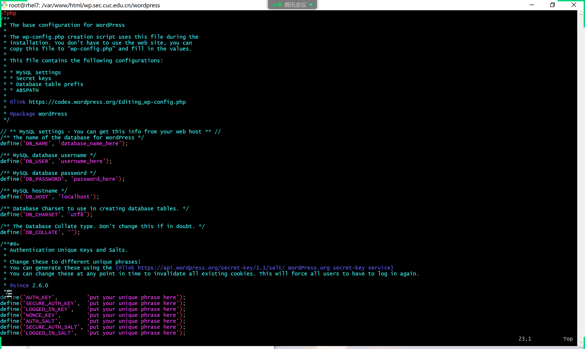
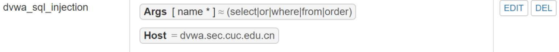
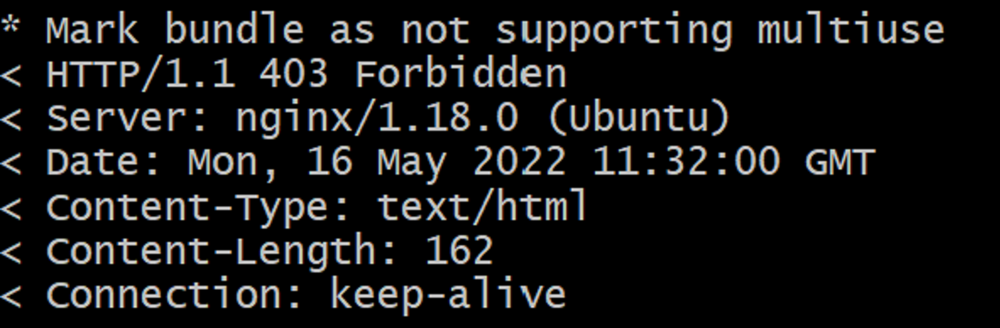

# Linux实验5 web服务器

## 实验环境：

ubuntu 20.04 

Nginx

VeryNginx

WordCompress 4.7


## 实验要求：

### 基本要求：

- 在一台主机（虚拟机）上同时配置

  Nginx

  和

  VeryNginx

  - VeryNginx作为本次实验的Web App的反向代理服务器和WAF
  - PHP-FPM进程的反向代理配置在nginx服务器上，VeryNginx服务器不直接配置Web站点服务

- 使用[Wordpress](https://wordpress.org/)搭建的站点对外提供访问的地址为： http://wp.sec.cuc.edu.cn

- 使用[Damn Vulnerable Web Application (DVWA)](http://www.dvwa.co.uk/)搭建的站点对外提供访问的地址为： http://dvwa.sec.cuc.edu.cn

### 安全加固要求：

- 使用IP地址方式均无法访问上述任意站点，并向访客展示自定义的**友好错误提示信息页面-1**

- [Damn Vulnerable Web Application (DVWA)](http://www.dvwa.co.uk/)只允许白名单上的访客来源IP，其他来源的IP访问均向访客展示自定义的**友好错误提示信息页面-2**

- 在不升级Wordpress版本的情况下，通过定制[VeryNginx](https://github.com/alexazhou/VeryNginx)的访问控制策略规则，**热**修复[WordPress < 4.7.1 - Username Enumeration](https://www.exploit-db.com/exploits/41497/)

- 通过配置[VeryNginx](https://github.com/alexazhou/VeryNginx)的Filter规则实现对[Damn Vulnerable Web Application (DVWA)](http://www.dvwa.co.uk/)的SQL注入实验在低安全等级条件下进行防护

  ### VeryNginx配置要求：

  - [VeryNginx](https://github.com/alexazhou/VeryNginx)的Web管理页面仅允许白名单上的访客来源IP，其他来源的IP访问均向访客展示自定义的**友好错误提示信息页面-3**

  - 通过定制

    VeryNginx

    的访问控制策略规则实现：

    - 限制DVWA站点的单IP访问速率为每秒请求数 < 50
    - 限制Wordpress站点的单IP访问速率为每秒请求数 < 20
    - 超过访问频率限制的请求直接返回自定义**错误提示信息页面-4**
    - 禁止curl访问


## 作业内容：

### 1、进入管理员权限，下载Nginx

```
su root 

apt install nginx
```


### 2、更改主机hosts文件

```
# nginx
192.168.56.101 vn.sec.cuc.edu.cn
192.168.56.101 dvwa.sec.cuc.edu.cn
192.168.56.101 wp.sec.cuc.edu.cn
```


### 3、php及相关组件

```
sudo apt install php-fpm php-mysql php-curl php-gd php-intl php-mbstring php-soap php-xml php-xmlrpc php-zip
```


### 4、Nginx

```
#使用wget命令下载所需要的包，这里使用 Stable版的 nginx-1.20.1 这个包
wget http://nginx.org/download/nginx-1.20.1.tar.gz
#解压这个包
tar -zxvf nginx-1.20.1.tar.gz
#进入解压目录
cd nginx-1.20.1
#自定义配置路径
./configure
#安装nginx
make && make install
#需要安装 libpcre3-dev
sudo apt-get install libpcre3-dev
#安装openssl
sudo apt-get install openssl
#进入nginx
cd /usr/local/nginx
#进入最小根目录
# /sbin
cd sbin
kill -9 -717
#启动
./nginx
```


### 5、VeryNginx

```
# 克隆VeryNginx仓库
git clone https://github.com/alexazhou/VeryNginx.git
cd VeryNginx
# python3
sudo python3 install.py install
```


安装python3前对缺失的库补充安装

```
# zlib
sudo apt-get update
sudo apt-get install zlib1g-dev
# pcre 
sudo apt-get install libpcre3 libpcre3-dev
# gcc 
sudo apt install gcc
# make
sudo apt install make
# penssl library
sudo apt install libssl-dev
```

配置

```
# 修改 `/opt/verynginx/openresty/nginx/conf/nginx.conf` 配置文件
sudo vim /opt/verynginx/openresty/nginx/conf/nginx.conf

#修改以下部分：

# 用户名
user  www-data;

# 监听端口
# 为了不和其他端口冲突，此处设置为8081
server {
        listen 192.168.56.101:8081;
        
        #this line shoud be include in every server block
        include /opt/verynginx/verynginx/nginx_conf/in_server_block.conf;

        location = / {
            root   html;
            index  index.html index.htm;
        }
    }
```


添加进程权限

```
chmod -R 777 /opt/verynginx/verynginx/configs

/opt/verynginx/openresty/nginx/sbin/nginx -s stop

/opt/verynginx/openresty/nginx/sbin/nginx
```


访问服务器的8081端口，安装成功


默认的用户名和密码verynginx/verynginx进入verynginx/index.html

登陆成功


### 6、WordPress

补充数据库信息

```
#更新高级软件包工具
sudo apt-get update
#安装MYSQL服务器
sudo apt-get install mysql-server
#查看MYSQL版本
sudo mysql -v
# 登录
sudo mysql
# 建库
CREATE DATABASE wordpress DEFAULT CHARACTER SET utf8 COLLATE utf8_unicode_ci;
# 新建用户
create user 'YYY'@'localhost' identified by 'YYY123456';
# 授权
grant all on wordpress.* to 'YYY'@'localhost;
```


安装与配置

```
# 下载安装包
sudo wget https://wordpress.org/wordpress-4.7.zip

# 解压
sudo apt install p7zip-full
7z x wordpress-4.7.zip

# 将解压后的wordpress移至指定路径
sudo mkdir /var/www/html/wp.sec.cuc.edu.cn
sudo cp -r wordpress /var/www/html/wp.sec.cuc.edu.cn

# 修改wp-config-sample中的内容，并更名为wp-config
cd /var/www/html/wp.sec.cuc.edu.cn/wordpress
sudo vim wp-config-sample.php
mv wp-config-sample.php wp-config.php
```

修改配置文件

```
sudo vim /var/www/html/wp.sec.cuc.edu.cn/wordpress/wp-config.php

// ** MySQL settings - You can get this info from your web host ** //
/** The name of the database for WordPress */
define('DB_NAME', 'wordpress');

/** MySQL database username */
define('DB_USER', 'username');

/** MySQL database password */
define('DB_PASSWORD', 'password');

/** MySQL hostname */
define('DB_HOST', 'localhost');

/** Database Charset to use in creating database tables. */
define('DB_CHARSET', 'utf8');

/** The Database Collate type. Don't change this if in doubt. */
define('DB_COLLATE', '');
```



创建nginx下的配置文件

```
sudo vim /etc/nginx/sites-enabled/default
#创建nginx下的配置文件
sudo cp /etc/nginx/sites-available/default /etc/nginx/sites-available/wp
#进入配置文件并进行部分修改
sudo vim /etc/nginx/sites-available/wp
 # 修改server_name
sever_name wp.sec.cuc.edu.cn
 # 添加index.php
index index.php index.html index.htm index.nginx-debian.html;
#使得链接生效
sudo ln -s /etc/nginx/sites-available/wp/etc/nginx/sites-enabled/
#语法检查
sudo nginx -t
#重启nginx
sudo systemctl restart nginx
```


修改hosts文件

```
cd /etc
sudo vim hosts
```

主机：


虚拟机：


访问网站：http://wp.sec.cuc.edu.cn/wordpress/wp-admin/


### 7、安装配置DVWA

安装

```
# 下载
git clone https://github.com/digininja/DVWA.git
# 建立目录
sudo mkdir /var/www/html/dvwa.sec.cuc.edu.cn
# 移动文件夹内容至该目录下
sudo mv DVWA/* /var/www/html/dvwa.sec.cuc.edu.cn
```

配置MySQL

```
sudo mysql
CREATE DATABASE dvwa DEFAULT CHARACTER SET utf8 COLLATE utf8_unicode_ci;
CREATE USER 'dvwa'@'localhost' IDENTIFIED BY 'p@ssw0rd';
GRANT ALL ON dvwa.* TO 'dvwa'@'localhost';
exit
```

配置PHP

```
sudo mv config.inc.php.dist config.inc.php
# 默认配置：
$_DVWA[ 'db_database' ] = 'dvwa';
$_DVWA[ 'db_user' ] = 'dvwa';
$_DVWA[ 'db_password' ] = 'p@ssw0rd';
# 修改php-fpm⽂件
sudo vim /etc/php/7.4/fpm/php.ini
display_errors: Off
safe_mode: Off
allow_url_include: On
allow_url_fopen: On
#重启php
systemctl restart php7.4-fpm.service
#授权给www-data⽤户和组
sudo chown -R www-data.www-data /var/www/html/dvwa.sec.cuc.edu.cn
```

配置服务器块文件

```
#创建配置文件
sudo cp /etc/nginx/sites-available/default /etc/nginx/sites-available/dvwa.sec.cuc.edu.cn
sudo vim /etc/nginx/sites-available/dvwa.sec.cuc.edu.cn
# 写⼊配置⽂件
server {
 listen 8080 default_server;
 listen [::]:8080 default_server;
 root /var/www/html/dvwa.sec.cuc.edu.cn;
 index index.php index.html index.htm index.nginx-debian.html;
 server_name dvwa.sec.cuc.edu.cn;
 location / {
 #try_files $uri $uri/ =404;
 try_files $uri $uri/ /index.php$is_args$args; 
 }
 location ~ \.php$ {
 include snippets/fastcgi-php.conf;
 fastcgi_pass unix:/var/run/php/php7.4-fpm.sock;
 }
 location ~ /\.ht {
 deny all;
 }
}
# 创建软链接
sudo ln -s /etc/nginx/sites-available/dvwa.sec.cuc.edu.cn /etc/nginx/sites-enabled/
# 检查并重启服务
sudo nginx -t
systemctl restart nginx.service
```

访问dvwa

网址：http://dvwa.sec.cuc.cn:8080/index.php


### 8、使用VeryNginx反向代理Wordpress,DVWA

matcher


Up stream


### 9、安全加固要求

使用IP地址方式均无法访问上述任意站点，并向访客展示自定义的友好错误提示信息页面-1

Matcher


Response


Filter


Result


Damn Vulnerable Web Application (DVWA)只允许⽩名单上的访客来源IP，其他来源的IP访问均向访客展示自定义的友好错误提示信息页面-2

Matcher


Response


Filter


结果


在不升级Wordpress版本的情况下，通过定制VeryNginx的访问控制策略规则，热修复WordPress < 4.7.1 -Username Enumeration

漏洞载入

拷贝漏洞文本到Linux主机，修改相应文本

```shell
$url = "http://wp.sec.cuc.edu.cn/";
```

安装依赖包

```shell
idchannov@id-srv:~$ sudo apt install php7.2-cli
```

执行脚本

```shell
idchannov@id-srv:~$ php err.php
```

制定安全策略

在Basic中添加匹配规则

在Custom Action中添加过滤条件

通过配置VeryNginx的Filter规则实现对Damn Vulnerable Web Application (DVWA)的SQL注入实验在低安全等级条件下进行防护

在Basic中添加匹配规则


在Custom Action中添加过滤条件


通过配置VeryNginx的Filter规则实现对Damn Vulnerable Web Application (DVWA)的SQL注入实验在低安全等级条件下进行防护

将security level修改为low


dvwa sql injection


Matcher



Response


Filter


### 10、VeryNginx配置要求

VeryNginx的Web管理页面仅允许白名单上的访客来源IP，其他来源的IP访问均向访客展示自定义的友好错误提示信息页面-3

在**Basic**中添加匹配规则


在Basic中添加友好错误提示信息页面-3的响应信息


在Custom Action中添加过滤条件


结果


通过定制VeryNginx的访问控制策略规则实现：

限制DVWA站点的单IP访问速率为每秒请求数 < 50

限制Wordpress站点的单IP访问速率为每秒请求数 < 20

超过访问频率限制的请求直接返回自定义错误提示信息页面-4

设置自定义response


设置频率限制Frequency Limit


结果


禁止curl访问

添加matcher


添加Response


添加filter


配置结果：




## 问题：

### 1、访问服务器的8081端口，访问不了，但显示我的Nginx是成功的


http://vn.sec.cuc.edu.cn:8081/verynginx/index.html网址一直进不去；后来，换成了IP+端口的模式http://192.168.56.101:8081/可以访问

### 2、Linux cp: omitting directory错误的原因及解决办法


文件夹下面还存在着其他的文件夹，所以不能直接拷贝到目标文件夹中。

解决方法：使用递归拷贝，在cp命令后面加上 -r 参数。 -r 表示递归的意思。

### 3、wp-config-sample里面没有内容的问题

一个原因是路径问题，可能没有写对

还有一个是可以直接在后面加上.php，把文件类型加上去

### 4、Job for nginx.service failed because the control process exited with error code. See “systemctl stat报错

网址：https://blog.csdn.net/weixin_44486991/article/details/88246972

### 5、WINSCP真的好好用，因为在做作业的过程中，很多路径和文件格式需要注意，不同的电脑和方法都是不一样的，而WINSCP可以很直观地让我们找到这些路径或者文件，对于做题真的很有帮助

### 6、配置DVWA的时候，一定要按照默认的设置用户名和密码，如果自己修改的话，很有可能会崩掉

### 7、主机hosts文件和虚拟机hosts文件都需要更改，如果不更改，就会出现网址登不上去的现象

## 参考网址：

【修改nginx配置文件】https://blog.csdn.net/shiki_41/article/details/81013279?spm=1001.2101.3001.6661.1&utm_medium=distribute.pc_relevant_t0.none-task-blog-2%7Edefault%7EOPENSEARCH%7Edefault-1-81013279-blog-96291053.pc_relevant_eslanding_v1&depth_1-utm_source=distribute.pc_relevant_t0.none-task-blog-2%7Edefault%7EOPENSEARCH%7Edefault-1-81013279-blog-96291053.pc_relevant_eslanding_v1&utm_relevant_index=1

【Linux常用软件安装】https://blog.csdn.net/vurtne_xb/article/details/122117200

【Linux目录结构中sbin,Linux文件系统目录结构详解】https://blog.csdn.net/weixin_42360899/article/details/116587765

【nginx配置说明以及VeryNginx使用】https://blog.csdn.net/weixin_40803329/article/details/101446194

【Linux cp: omitting directory错误的原因及解决办法】https://blog.csdn.net/decan5958/article/details/81032523?spm=1001.2101.3001.6661.1&utm_medium=distribute.pc_relevant_t0.none-task-blog-2%7Edefault%7ECTRLIST%7ERate-1-81032523-blog-81536962.pc_relevant_paycolumn_v3&depth_1-utm_source=distribute.pc_relevant_t0.none-task-blog-2%7Edefault%7ECTRLIST%7ERate-1-81032523-blog-81536962.pc_relevant_paycolumn_v3&utm_relevant_index=1

【Job for nginx.service failed because the control process exited with error code. See “systemctl stat】https://blog.csdn.net/weixin_44486991/article/details/88246972

【DVWA安装、配置、使用教程（Linux）】https://www.cnblogs.com/lsdb/p/6826519.html